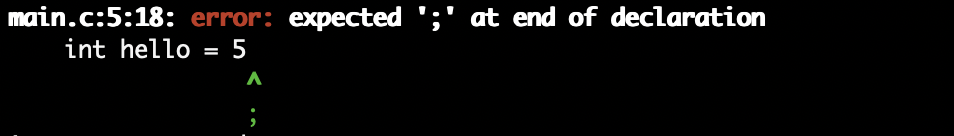

# Compiler Error Messages

## Contents

* [Unexpected... / Expected...](#Unexpected...-/-Expected...)

<br>

## Overview

### Error Output Syntax:

```
file:line:column: error: message
  print line with possible error
```

### Example Error Output 1:

The green caret below the offending line of code indicates where the compiler thinks the error is. In this case, "hello" is uninitialized.


* File Name: main.c
* Line Number: 5
* Column Number: 5
* Error Message: "use of undeclared identifier 'hello'"

### Example Error Output 2:

In this one, there is a semicolon below the green caret indicating that the compiler thinks a semicolon should be inserted at that point. 



* File Name: main.c
* Line Number: 5
* Column Number: 18
* Error Message: "expected ';' at end of declaration"

<br>

## Unexpected... / Expected...

Syntax error. Check the line and the line above it for problems with punctuation such as parentheses, quote marks, commas, semicolons, etc. Make sure your conditional, loops, and switch statements are formatted correctly. Every left parenthesis/brace/quote should have a right one.

<br>

## Core Dump, Segmentation Fault

Program tried to access memory it didn't have permission for.

* Accessing an array index out of bounds
* Improper use of pointers. Trying to dereference a non-pointer.
* Infinite recursion
* Accessing an address that has been freed

   ```c
   int arr[5] = {1, 2, 3, 4, 5};
   int five = arr[5];  // Index out of bounds
   ```

<br>

## Undeclared Identifier
 
Attempting to use a variable without declaring it first. Make sure you did not misspell the variable name compared to how you declared it.  

<br>

## Implicit Declaration of Function ... Invalid

Trying to call a function that the linker cannot find. 

* Include correct header for that function if needed
* Declare the function before using it in the same file